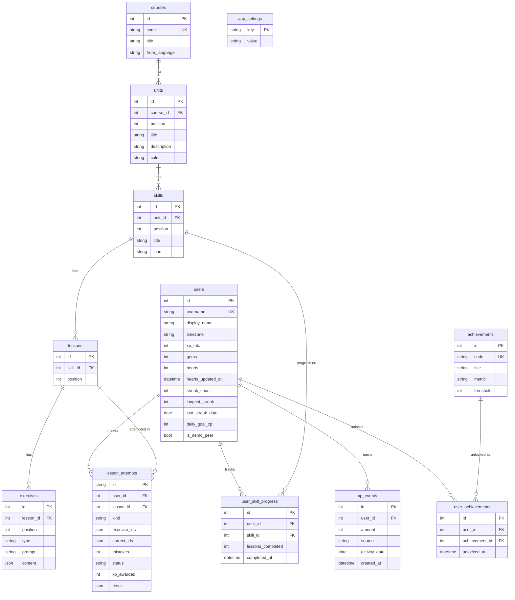

# Duolingo Clone

**Live demo:** https://duolingo-clone-murex.vercel.app · **API:** https://duolingo-clone-api-lmzz.onrender.com/docs
(The free-tier backend sleeps when idle, so the first load can take up to a minute.)

A functional clone of the Duolingo web app. It covers the learning path, a lesson player with five interactive exercise types, and the full gamification loop: XP, streaks, hearts, gems, daily goal, leagues and achievements. It ships with a seeded Spanish course.

| | |
|---|---|
| **Frontend** | Next.js 15 (App Router) · TypeScript · Tailwind CSS v4 |
| **Backend** | Python 3.12 · FastAPI · SQLAlchemy 2 · Pydantic 2 |
| **Database** | SQLite (custom schema, auto-seeded on first start) |
| **Tests** | pytest (22 unit + API tests) |

---

## Features

**Learning path**
- Winding path of units and skills.
- Each skill is shown as completed (crown), active (progress ring with a bouncing START/CONTINUE bubble) or locked.
- Sticky unit banners with a guidebook.
- Node popovers with START / PRACTICE / LOCKED actions.

**Lesson player**
- Five exercise types:
  - multiple choice (picture cards or text)
  - translate with a tap-the-words word bank
  - match pairs
  - fill in the blank
  - type the answer, with an accent keyboard
- CHECK → green/red feedback bar → CONTINUE.
- Progress bar, SKIP, and keyboard shortcuts (1–9 to pick, Enter to check/continue).
- Mistakes are re-queued at the end of the lesson, as in Duolingo.
- Typed answers tolerate missing accents and single typos, and say so ("You have a typo").
- Text-to-speech audio for Spanish, plus synthesized correct/wrong sounds.

**Hearts**
- Lose one per wrong answer.
- At 0 the "You ran out of hearts" modal appears, with three options:
  - refill with (mock) gems
  - practice to earn a heart
  - quit
- Hearts regenerate one every 30 minutes, with a live countdown.

**Rewards**
- XP: 10 per lesson, plus 5 for a perfect lesson.
- Gems: 20 for finishing a skill.
- Daily goal (10/20/30/50 XP) with a progress card.
- Streak flame that lights once you've practised today.
- "Lesson complete" screen with confetti and stat cards, then a "day streak!" screen.
- Achievements with toasts and progress bars.

**Leaderboard:** a weekly Bronze league against seeded learners, with promotion and demotion zones.

**Other pages**
- **Profile:** stats, 7-day XP chart, achievements.
- **Shop:** heart refill, practice, Coming Soon power-ups.
- **Quests:** daily goal quest.
- **Settings:** name, daily goal, timezone, sound, light/dark/system theme.
- **Developer tools:** simulate the next day, skip a day, reset demo data.

**Responsive:** sidebar on desktop, icon rail on tablet, bottom tab bar on mobile. Dark mode is supported.

**Placeholders, as allowed by the brief:** speaking exercises, Super subscription, friends, multiple courses, and real authentication.

---

## Quick start

Prerequisites: **Python 3.12+** and **Node.js 20+**.

```bash
# 1. Backend (http://localhost:8000; API docs at /docs)
cd backend
python -m venv .venv
# Windows: .venv\Scripts\activate    macOS/Linux: source .venv/bin/activate
pip install -r requirements-dev.txt
uvicorn app.main:app --reload --port 8000
```

```bash
# 2. Frontend (http://localhost:3000), in a second terminal
cd frontend
npm install
npm run dev
```

The database file (`backend/duolingo.db`) is created and seeded automatically on first start. The seed contains one course, a demo learner with some progress and a 4-day streak, and nine leaderboard peers.

```bash
# Reset the database to the seeded state
cd backend && python -m app.seed --reset

# Run the backend test suite
cd backend && python -m pytest -q

# Type-check, lint and production-build the frontend
cd frontend && npx tsc --noEmit && npm run lint && npm run build
```

---

## Architecture

```
 Browser ──► Next.js (frontend/) ──/api/* rewrite──► FastAPI (backend/) ──► SQLite
             React client components           routers → services → SQLAlchemy models
```

- **Same-origin API proxy.** The browser only ever calls `/api/*` on the Next.js origin, and `next.config.ts` rewrites those calls to `BACKEND_URL`. This means no CORS setup and no backend URL in client bundles.
- **The server is authoritative.** Answer keys never leave the backend: `services/grading.py` strips them from exercise payloads. Every answer is checked by `POST /attempts/{id}/answers`. The server tracks which exercises in an attempt were answered correctly, and only grants XP when every one has been. Completion is idempotent, so retrying it never double-awards XP.
- **Time is injectable.** All game rules get "now" from `services/clock.py`. A persisted day offset powers the "simulate next day" dev tool, and tests monkeypatch the clock. Streaks and daily XP use the learner's **local** date (from their timezone).
- **Hearts regenerate lazily.** There is no background job. Regeneration is computed whenever the learner is read, from `hearts_updated_at`, and the anchor only advances by whole intervals so partial progress is never lost.

### Backend layout (`backend/app`)

| Path | Responsibility |
|---|---|
| `main.py` | App factory, CORS, error handlers, router registration, seeding on startup |
| `config.py` | Settings from environment variables |
| `database.py` / `models.py` | Engine/session (SQLite foreign keys on) and ORM models |
| `schemas.py` | Pydantic request/response models (the API contract) |
| `deps.py` | `RequestContext`: DB session, current learner, simulated now/today |
| `routers/` | Thin HTTP layer: `me`, `course`, `lessons`, `leaderboard`, `shop`, `dev` |
| `services/grading.py` | Answer normalization and grading; answer-key stripping |
| `services/gamification.py` | Hearts, streak, XP and achievement rules (pure, unit-tested) |
| `services/progress.py` | Path state: completed / active / locked |
| `services/lesson_flow.py` | Attempt lifecycle: start → answer → complete |
| `seed/` | Course content (`course_content.py`), seeder and CLI |

### Frontend layout (`frontend/src`)

| Path | Responsibility |
|---|---|
| `app/(app)/*` | Pages with the app shell: `learn`, `leaderboard`, `quests`, `shop`, `profile`, `settings` |
| `app/lesson/[lessonId]`, `app/practice` | Full-screen lesson player routes |
| `components/path/` | Learning path, path nodes, progress ring, popovers |
| `components/lesson/` | `LessonPlayer` (state machine), `FeedbackFooter`, celebrations, one component per exercise type |
| `components/layout/` | Sidebar / bottom nav, stats bar with dropdowns, right rail cards |
| `components/ui/` | 3D `Button`, `Modal`, `Toast`, `ProgressBar`, `Mascot` (original SVG owl), icons |
| `lib/` | Typed API client, shared types, user/theme contexts, audio helpers |

---

## Database schema



Design notes:

- **Content is a strict hierarchy** (course → unit → skill → lesson → exercise).
  - Each level has a `position` column with a `UNIQUE(parent_id, position)` constraint and `ON DELETE CASCADE`.
  - `exercises.type` is limited by a CHECK constraint to the five types.
  - Each exercise's type-specific payload (choices, word bank, pairs, answers) is stored as JSON in `content`. This keeps one table instead of five near-identical ones while the type column stays queryable.
- **`xp_events` is an append-only ledger.**
  - The daily goal, the weekly leaderboard and the 7-day chart are all aggregations over it, indexed on `(user_id, activity_date)`.
  - `users.xp_total` is a denormalized running total for cheap reads.
- **`lesson_attempts`** tracks one run through a lesson or practice session.
  - It records the exercises served, which ones were answered correctly, mistakes and status.
  - It caches the completion `result`, so completion is idempotent.
  - It is also the source of "lessons completed" and "perfect lessons" for achievements.
- **`user_skill_progress`** has one row per (user, skill) and stores `lessons_completed`. Replaying an earlier lesson doesn't advance it twice.
- **Streak state lives on `users`** (`streak_count`, `last_streak_date`). A streak is "alive" while `last_streak_date >= today - 1`; the API returns 0 once a day has been missed.
- **Integrity:** CHECK constraints stop hearts and gems going negative, and SQLite foreign keys are enforced through `PRAGMA foreign_keys=ON`.
- **Migrations:** for this assignment, tables are created with `create_all` on startup. A real deployment would add Alembic migrations.

---

## API overview

Base path `/api`. Interactive docs are at `http://localhost:8000/docs`. All errors use one envelope, `{"error": {"code", "message"}}`, with stable codes such as `out_of_hearts`, `lesson_locked`, `lesson_incomplete`, `insufficient_gems` and `validation_error`.

| Method | Endpoint | Description |
|---|---|---|
| GET | `/me` | Learner stats: XP, gems, hearts (+ seconds to next heart), streak, daily goal progress |
| PATCH | `/me` | Update `display_name`, `daily_goal_xp` (10/20/30/50), `timezone` (IANA) |
| GET | `/profile` | Stats, 7-day XP history, achievements with progress |
| GET | `/course` | Learning path: units → skills with status, progress and `next_lesson_id` |
| POST | `/lessons/{id}/attempts` | Start a lesson. Returns exercises **without answers**. 403 if locked or out of hearts |
| POST | `/practice/attempts` | Start a practice session from completed lessons (no heart cost, +1 heart on completion) |
| POST | `/attempts/{id}/answers` | `{exercise_id, answer}` → `{correct, solution, note, hearts, remaining}` |
| POST | `/attempts/{id}/complete` | Award XP / streak / skill progress / gems / achievements. Idempotent |
| GET | `/leaderboard` | Weekly league standings (Monday–Sunday in the learner's timezone) |
| POST | `/shop/refill-hearts` | Spend 350 mock gems to refill hearts |
| POST | `/dev/advance-day` | Simulate days passing (`{days}`). Only when `ENABLE_DEV_TOOLS=true` |
| POST | `/dev/reset` | Wipe progress and re-seed. Only when `ENABLE_DEV_TOOLS=true` |
| GET | `/health` | Health check |

Answer formats by exercise type:
- `multiple_choice`: option index
- `translate`: list of words
- `match_pairs`: list of `[left, right]` pairs
- `fill_blank`: the chosen word
- `type_answer`: free text

---

## Configuration

**Backend** (`backend/.env.example`; all optional):

| Variable | Default | Purpose |
|---|---|---|
| `DATABASE_URL` | `sqlite:///backend/duolingo.db` | SQLAlchemy URL |
| `CORS_ORIGINS` | `http://localhost:3000` | Comma-separated origins (only needed if you call the API directly) |
| `HEART_REGEN_MINUTES` | `30` | Minutes per regenerated heart |
| `ENABLE_DEV_TOOLS` | `true` | Exposes `/api/dev/*` and the Settings → Developer tools panel |
| `DEFAULT_USERNAME` | `learner` | The seeded learner every request acts as |
| `DEFAULT_TIMEZONE` | `UTC` | Timezone of the seeded learner (streak/daily-goal day boundaries) |

**Frontend** (`frontend/.env.example`):

| Variable | Default | Purpose |
|---|---|---|
| `BACKEND_URL` | `http://localhost:8000` | Where Next.js proxies `/api/*` (read at build time) |

No secrets are required.

---

## Deployment

- **Backend → Render.** Create a Blueprint from this repo. `render.yaml` defines the service: root `backend/`, start command `uvicorn app.main:app --host 0.0.0.0 --port $PORT`, health check `/api/health`. A `backend/Dockerfile` is also included for Railway, Fly.io or any Docker host; mount a volume at `/data` to persist SQLite.
- **Frontend → Vercel.** Import the repo, set **Root Directory** to `frontend`, and set the environment variable `BACKEND_URL=https://<your-backend>.onrender.com`.

> **Note on free hosting:** Render's free tier has an ephemeral filesystem and sleeps after ~15 minutes idle. Progress persists in SQLite while the instance runs, but resets to the seeded demo state after a restart or redeploy. Use a persistent disk or volume for durable storage. The first request after sleeping can take up to about a minute; the frontend retries and shows a "waking up" state.

---

## Assumptions & decisions

- **Authentication is simplified**, as the brief allows. Every request acts as the seeded learner (`deps.get_context`), so swapping in real sessions/JWT only touches that one function. Leaderboard peers are seeded users.
- **One course** (Spanish for English speakers): 3 units, 8 skills, 16 lessons, 128 exercises. All sentences were written for this project.
- **Progress model:** each path node is a skill with 2 lessons; finishing all of them completes the skill (crown + 20 gems). The path is linear, and locked skills/lessons are rejected server-side.
- **Gamification constants** (`services/gamification.py`):
  - max hearts 5; 1 heart regenerates every 30 min
  - refill costs 350 gems
  - 10 XP per lesson, +5 for a perfect lesson, 10 XP per practice
- **Match pairs:** mismatched taps shake but don't cost hearts (current Duolingo behavior). The pairs are sent to the client because they are the exercise; the final submission is still verified by the server.
- **Audio** uses the browser's Speech Synthesis API (no audio files). Speaking exercises are out of scope.
- **The visual design** recreates Duolingo's look (palette, 3D buttons, feedback bar, path, layout) using the Nunito font, hand-drawn SVG icons and an original owl mascot. No Duolingo assets are copied.

## Known limitations / future work

- No real authentication or multi-user sessions; dev tools are public while enabled.
- SQLite with a single process. For multiple workers, move to Postgres and add row locking around hearts and answers.
- No Alembic migrations, rate limiting or frontend unit tests. The frontend was verified manually in the browser (see the testing notes in the handoff).
- In development, React StrictMode starts lesson attempts twice. The duplicate attempt is never used, and production builds are unaffected.
